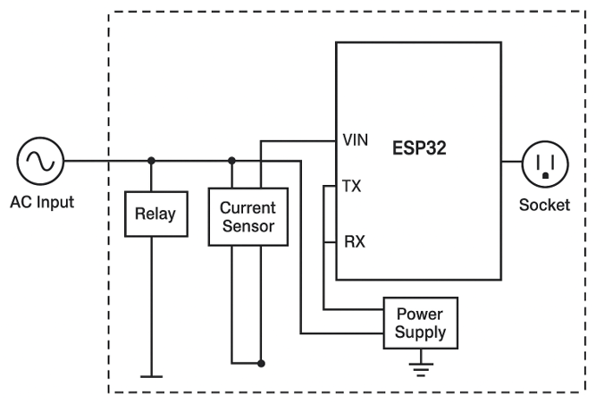
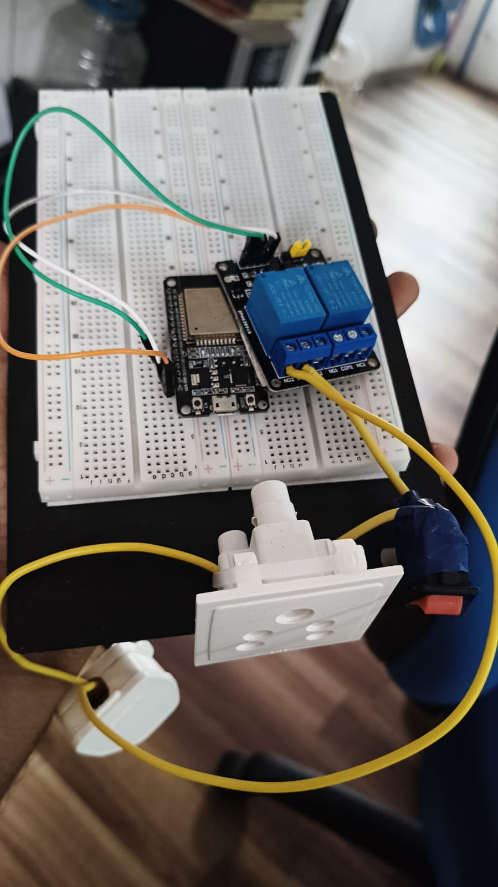

# Smart Energy Monitoring Plug ⚡

## 📌 Overview
An IoT-based smart plug that allows users to remotely control appliances and monitor real-time energy consumption.

## 🚀 Features
- Remote ON/OFF control using mobile app
- Real-time current monitoring
- Power (W) and energy (kWh) calculation
- OLED display for live data
- Wi-Fi connectivity using ESP32

## 🛠️ Tech Stack
- ESP32
- Arduino IDE
- Blynk IoT
- ACS712 Current Sensor
- OLED SSD1306

## ⚙️ Working
The system measures current using ACS712 sensor and calculates RMS current. Power and energy consumption are computed and sent to a mobile dashboard via Wi-Fi.

## 🔌 Hardware Components
- ESP32
- Relay Module
- ACS712 Sensor
- OLED Display
- Socket & Plug

## 🧩 System Architecture

AC Input → Sensor → ESP32 → WiFi → Blynk App → User Control

## 📊 Future Improvements
- Overload protection
- AI-based energy suggestions
- Custom mobile application

## 📸 Project Demo

## 🎯 Problem Solved
Traditional plugs do not provide real-time monitoring or remote control, leading to energy wastage. This project provides a smart, affordable solution for energy tracking and automation.

## 👨‍💻 Author
Aryav Agrawal
